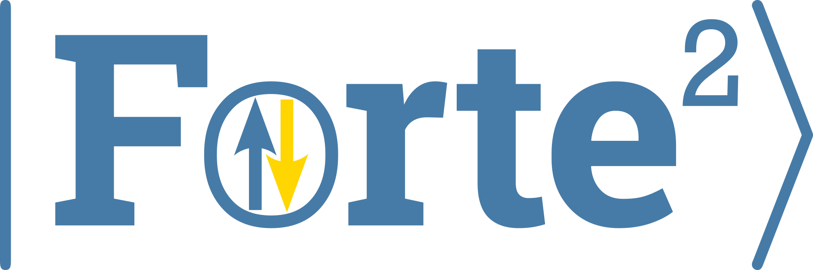

<h1 align="center">

</h1><br>

[](https://github.com/evangelistalab/forte2/actions/workflows/build.yml)
[](https://codecov.io/github/evangelistalab/forte2)
[](http://forte2.readthedocs.io/en/latest/?badge=latest)
[](https://anaconda.org/conda-forge/forte2)

# Forte2

Forte2 is a standalone, open-source suite of quantum chemistry methods, with a focus on multi-reference and relativistic methods.

**Code authors**: [Evangelista Lab](https://evangelistalab.org/index.html)  
**Documentation**: [Read the Docs](http://forte2.readthedocs.io/en/latest/)

> [!WARNING]
> Forte2 is currently in pre-release development.
> Interfaces and behavior may change between releases.
> Please report bugs or breaking behavior in the [issue tracker](https://github.com/evangelistalab/forte2/issues).

## Installation

### Option 1: Install from conda-forge
Forte2 is released on conda-forge for Linux (x86_64, aarch64, and ppc64le) and macOS (x86_64 and arm64) platforms.
If your platform is supported, this is the easiest way to use Forte2. Simply run:
```bash
conda install -c conda-forge forte2
```

### Option 2: Build from source

Use this path if your platform is not covered by conda-forge packages, or if you want to contribute to Forte2.

```bash
git clone git@github.com:evangelistalab/forte2.git
cd forte2
conda env create -f environment.yml
conda activate forte2
pip install --no-build-isolation -ve .
```

### Testing the installation

You can run the standard fast test subset with:

```bash
pytest -m "not slow"
```

or run the full test suite with:

```bash
pytest
```

## Quickstart

Forte2 adheres to a functional composition workflow, where users build a final object by applying a sequence of methods to a `System` object. For example, a typical workflow might look like:

```python
import forte2

system = forte2.System(
    xyz="""
    N 0.0 0.0 0.0
    N 0.0 0.0 1.2
    """,
    basis_set="cc-pvdz",
    auxiliary_basis_set="cc-pVTZ-JKFIT",
)

rhf = forte2.RHF(charge=0, econv=1e-12)(system)
avas = forte2.AVAS(
    selection_method="separate",
    subspace=["N(2p)"],
    num_active_docc=3,
    num_active_uocc=3,
)(rhf)
mcscf = forte2.MCOptimizer(
    states=[forte2.State(nel=14, multiplicity=1, ms=0.0),
            forte2.State(nel=14, multiplicity=3, ms=0.0)],
)(avas)
pt = forte2.DSRG_MRPT2(s=0.5)(mcscf)

pt.run()
```
This sets up a state-averaged driven similarity renormalization group second-order multi-reference perturbation theory (DSRG-MRPT2) calculation on the nitrogen molecule, using the cc-pvDZ basis set and the cc-pVTZ-JKFIT auxiliary basis set, with an initial active space most resembling the 6 nitrogen 2p orbitals, automatically selected by the AVAS procedure.

## Obtaining integrals

Forte2 interfaces with both the [libint2](https://github.com/evaleev/libint) and [libcint](https://github.com/sunqm/libcint) integral engines behind the scenes, and provides a common and simple interface for obtaining integrals in Python, as shown below.

```python
import forte2

system = forte2.System(
    xyz="C 0 0 0; N 0 0 1.4",
    basis_set="cc-pvdz",
    auxiliary_basis_set="cc-pvdz-jkfit",
)

S = forte2.integrals.overlap(system)
T = forte2.integrals.kinetic(system)
V = forte2.integrals.nuclear(system)
# the order is (P|mn) in row-major order regardless of backend
# P is the auxiliary basis and m, n are the orbital basis
B = forte2.integrals.coulomb_3c(system)
```

## Capabilities

Forte2 is under active development, with an emphasis on multi-reference and relativistic methods.
Current capabilities include:

- All methods use density-fitted or Cholesky-decomposed two-electron integrals
- Model Hamiltonians and molecular symmetry support (largest Abelian subgroup)
- Non-relativistic and relativistic SCF (RHF, ROHF, UHF, CUHF, GHF)
- CI methods including spin-adapted CI, GAS/ORMAS, and relativistic CI
- MCSCF methods (CAS/GAS/ORMAS), with state averaging, and relativistic variants thereof
- AVAS active-space selection (one- and two-component workflows)
- DSRG-MRPT2 (non-relativistic and relativistic)
- Orbital analysis/manipulation tools (ASET, IAO, IBO, cube generation)

For detailed method documentation and theory references, see:
- [User Guide](http://forte2.readthedocs.io/en/latest/guide/index.html)
- [API Reference](http://forte2.readthedocs.io/en/latest/modules.html)


## Contributing

We are open to contributions of all kinds, including bug reports, feature requests, documentation improvements, and code contributions.

For code contributions, see notes on coding style and docstring standards in the [Contributor Guide](http://forte2.readthedocs.io/en/latest/contributor.html).
