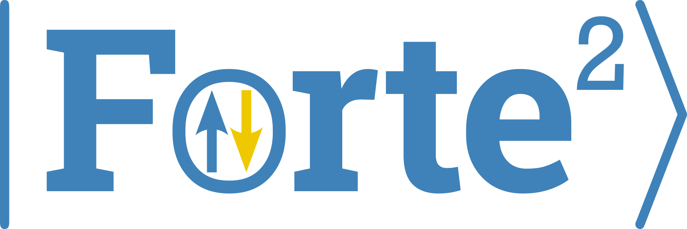

<h1 align="center">

</h1> 

Forte2: An open-source suite of quantum chemistry methods for strongly correlated electrons

> [!WARNING]
> Forte2 is currently in pre-release development. 
> This means that there are no guarantees that functionalities and interfaces won't break
> from version to version, though we will minimize breaking changes 
> between minor / patch releases, and only introducing breaking changes in major releases.
> Please use with caution and report any issues you encounter on the [GitHub issue tracker](https://github.com/evangelistalab/forte2/issues).

**Code authors**: [Evangelista Lab](https://evangelistalab.org/index.html)

**Documentation**: [Read the Docs](http://forte2.readthedocs.io/en/latest/)
